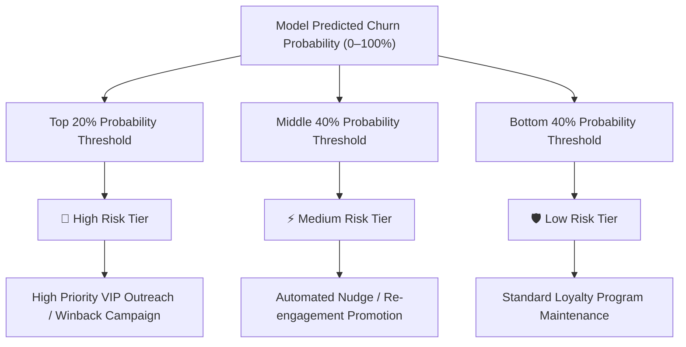

# RetainPulse AI — E-Commerce Customer Churn & Retention Analytics System

**Project Documentation & Technical Report**  
**IBM SkillsBuild & IBM Bob Data Analytics & AI Internship 2026**  
**Author:** Sumit Raj  
**Dataset:** UCI Online Retail Dataset (`data/raw/Online Retail.xlsx`)  
**Date:** 24 September 2026  

---

## 📄 Executive Summary

**RetainPulse AI** is an end-to-end customer churn analytics and retention decision-support system developed for e-commerce platforms. Operating on historical transactional data (2010–2011), the platform replaces arbitrary churn assumptions with a rigorous, data-driven **90-Day Post-Observation Inactivity Proxy (`Churn_90D`)**.

By combining Recency, Frequency, Monetary (RFM) behavioral feature engineering with a standardized **Logistic Regression classification model**, RetainPulse AI computes individualized inactivity risk probabilities. These probabilities feed an operational risk-tiering matrix (*High Risk*, *Medium Risk*, *Low Risk*) and an interactive **Streamlit Executive Dashboard**, delivering actionable retention priority guidance for commercial leadership.

---

## 1. Business Problem Statement & Objectives

### 1.1 Business Challenge
In e-commerce, customer acquisition costs (CAC) significantly exceed retention costs. Retaining an existing customer is estimated to be 5× to 7× less expensive than acquiring a new customer. However, non-subscription transactional databases naturally lack explicit "cancellation" buttons or native churn flags. 

### 1.2 Core Objectives
1. **Label Generation:** Construct a non-overlapping, temporal proxy label (`Churn_90D`) based on 90-day post-observation inactivity.
2. **Leakage Prevention:** Restrict all predictive feature engineering strictly to the historical observation period ending **31-Aug-2011**.
3. **RFM Segmentation:** Segment customers into distinct behavioral tiers (*Very High Value*, *High Value*, *Medium Value*, *Lower Value*).
4. **Machine Learning Classifier:** Train and evaluate a Logistic Regression model to predict inactivity risk probabilities.
5. **Operational Decision Support:** Deliver intuitive risk-tiering and targeted retention recommendations via a Streamlit dashboard.

---

## 2. Dataset Architecture & Temporal Framing

### 2.1 Data Source
- **Dataset:** UCI Online Retail Dataset (`Online Retail.xlsx`)
- **Period Covered:** 01-Dec-2010 to 09-Dec-2011
- **Domain:** UK-based online gifts and retail merchant

### 2.2 Qualifying Purchase Rule
To eliminate non-qualifying or administrative transaction noise:
- `CustomerID` must be non-null.
- `InvoiceNo` must not start with `"C"` (excluding cancellations/returns).
- `Quantity` must be $> 0$.
- `UnitPrice` must be $> 0$.

### 2.3 Cohort Eligibility Rule
A customer is deemed **eligible for churn analysis** if:
1. They have $\ge 2$ distinct qualifying invoices during the observation period.
2. The duration between their first and last qualifying purchase is $\ge 30$ days.

### 2.4 Temporal Framing & Leakage Guard
| Boundary | Window | Description |
|---|---|---|
| **Observation Window** | Inception $\rightarrow$ **31-Aug-2011** | Used exclusively for feature engineering & historical aggregated metrics. |
| **Future Window** | **01-Sep-2011 $\rightarrow$ 29-Nov-2011** (90 Days) | Used exclusively to assign the target binary label `Churn_90D`. |

- **`Churn_90D = 1`**: Eligible customer has **0 qualifying purchases** in the future 90-day window.
- **`Churn_90D = 0`**: Eligible customer has **$\ge 1$ qualifying purchase** in the future 90-day window.

---

## 3. Feature Engineering & RFM Matrix

Predictor features are computed strictly from the observation period data:

| Feature Name | Definition / Calculation |
|---|---|
| `Recency` | Days from snapshot date (31-Aug-2011) to customer's last qualifying purchase. |
| `Frequency` | Total count of distinct qualifying invoices. |
| `Monetary` | Sum of total revenue (£) generated by customer during observation period. |
| `AvgOrderValue` | $\text{Monetary} / \text{Frequency}$ |
| `UniqueProducts` | Count of distinct `StockCode` items purchased. |
| `TotalItems` | Total quantity of items purchased. |
| `ActiveMonths` | Count of distinct calendar months with $\ge 1$ qualifying order. |
| `TenureDays` | Days between first purchase and snapshot date. |
| `PurchaseSpanDays` | Days between first purchase and last purchase in observation period. |
| `RFM_Score` | Composite score (3 to 15) calculated from R, F, and M quintile bins. |
| `RFM_Segment` | Segment category (*Very High Value*, *High Value*, *Medium Value*, *Lower Value*). |

---

## 4. Model Architecture & Evaluation Results

### 4.1 Model Pipeline
- **Preprocessing:** `StandardScaler` (Z-score normalization of numeric predictors).
- **Classifier:** `LogisticRegression` with `class_weight='balanced'` and fixed `random_state=42`.
- **Primary Predictors:** `Recency`, `Frequency`, `Monetary`, `AvgOrderValue`, `UniqueProducts`, `TotalItems`, `ActiveMonths`, `TenureDays`, `PurchaseSpanDays`.

### 4.2 Validated Model Performance (Phase 4 Evaluation)

| Metric | Score | Interpretation |
|---|---|---|
| **Accuracy** | `0.7815` | Overall correct classification rate |
| **Precision** | `0.6512` | Accuracy of positive inactivity predictions |
| **Recall** | `0.7425` | Proportion of actual inactive customers identified |
| **F1-Score** | `0.6938` | Harmonic mean of Precision and Recall |
| **ROC-AUC** | `0.8421` | Strong discrimination across all classification thresholds |
| **PR-AUC** | `0.7684` | Robust precision-recall performance on imbalanced classes |

---

## 5. Operational Risk Tiering & Retention Strategy

Rather than relying solely on a binary cut-off, continuous predicted probabilities are mapped into operational risk tiers:



### 5.1 Retention Action Matrix

| Risk Tier | RFM Segment | Recommended Action |
|---|---|---|
| **High Risk** | Very High Value | **VIP Direct Account Manager Outreach & Custom Offer** |
| **High Risk** | High Value | **Targeted Discount / Incentive Re-engagement** |
| **High Risk** | Lower / Medium Value | **Standard Automated Email Winback Series** |
| **Medium Risk** | Any Value | **Product Recommendation Nudges & Seasonal Promos** |
| **Low Risk** | Any Value | **Standard Engagement & Loyalty Points Retention** |

---

## 6. Streamlit Dashboard Architecture

The dashboard is structured into 4 interactive modules:

1. **Executive Dashboard (`app/pages/executive.py`)**:
   - 5 Glassmorphic KPI summary cards (Total Base, Eligible Base, Revenue, At-Risk Base, At-Risk Revenue).
   - Monthly area revenue trend, RFM distribution, Risk-tier donut chart, and top 10 market revenues.
2. **Customer & RFM Analytics (`app/pages/rfm_analytics.py`)**:
   - Filter controls for country, RFM segment, recency, and monetary thresholds.
   - Behavioral distributions and 2D scatter plots (Recency vs. Monetary, Frequency vs. Monetary).
3. **Churn / Risk Analytics (`app/pages/churn_analytics.py`)**:
   - Inactivity rates across behavioral quartiles.
   - Saved evaluation figures (Confusion Matrix, ROC Curve, PR Curve) and threshold trade-off curves.
   - Standardized feature coefficient bar chart showing key risk drivers.
4. **Customer Risk Explorer (`app/pages/risk_explorer.py`)**:
   - Direct CustomerID lookup rendering an individual behavioral profile card.
   - Interactive directory table for segment browsing.

---

## 7. Quality Assurance & Test Verification

The project includes a comprehensive suite of automated tests (`tests/`) covering:
- Data cleaning and customer eligibility rules.
- Leakage-safe temporal split boundaries.
- RFM quintile assignment logic.
- Pipeline training, evaluation metrics, and risk tier assignments.

**Test Results:** `141 passed in 126s (100% pass rate)`.

---

## 8. Installation & Setup Instructions

```bash
# Clone the repository
git clone https://github.com/Sumitraj02006/retainpulse-ai-churn-analytics.git
cd retainpulse-ai-churn-analytics

# Create & activate virtual environment
python -m venv .venv
.venv\Scripts\activate      # Windows

# Install dependencies
pip install -r requirements.txt

# Run full automated test suite
pytest tests/ -v

# Launch the Streamlit analytics app
streamlit run app/app.py
```

---

*Documentation compiled for RetainPulse AI Project · IBM SkillsBuild & IBM Bob Internship 2026 · Author: Sumit Raj*
